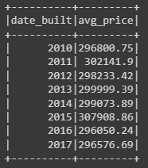
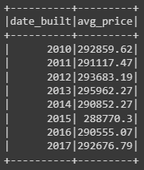
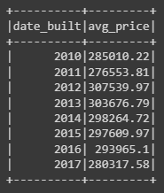
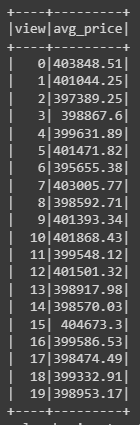

# Home_Sales

## **Module 22 Challenge - UCI Data Analytics Bootcamp**

## **Vincent Passanisi**

## **Due Date March 29, 2023**

---
  

# **INTRODUCTION**

In this challenge, we were asked to use our knowledge of SparkSQL to determine key metrics about home sales data. Then we used Spark to create temporary views, partition the data, cache and uncache a temporary table, and verify that the table had been uncached.
  

# **FILES**

* ***ReadMe.md*** - Markdown file with information about the repo and challenge.

* ***home_sales*** folder - Contains the challenge files for the homework

* ***images*** folder - contains the images used in the README file.

* ***Home_Sales_colab_complete.ipynb*** - the completed Google Collab notebook file.
  

# **RESULTS**

Dataframe was read into the notebook, and I evaluated the schema. I decided to change the view and price to integers since I would be working and sorting those numbers. I didn't like how they sorted as strings, so I think that was the right choice. The SQL queries were very straightforward. I definitely noticed a difference in speed by using the partitioned data. For the final query, the first time it ran at 1.63 seconds. When the temporary table was cached, it ran in 0.76 seconds. The same query using partitioned data ran in 0.58 seconds. An improvement, even for a small data set.

The table was successfully uncached at the end of the notebook.

Answer the following questions using SparkSQL:

What is the average price for a four-bedroom house sold for each year? Round off your answer to two decimal places.

What is the average price of a home for each year it was built that has three bedrooms and three bathrooms? Round off your answer to two decimal places.

What is the average price of a home for each year that has three bedrooms, three bathrooms, two floors, and is greater than or equal to 2,000 square feet? Round off your answer to two decimal places.

What is the "view" rating for homes costing more than or equal to $350,000? Determine the run time for this query, and round off your answer to two decimal places.

  

# **COMMENTS AND THOUGHTS**

This challenge seemed very straightforward and was one of the less time-consuming homework assignments we were given. It was fun to get back to using SQL, and interesting to learn the different syntax of Spark and PySpark. Still getting a little used to the change, but there was much that was familiar. I'm looking forward to reading more of the Spark documentation, and I'm wanting to go back and review SQLAlchemy when the class is over. What a great learning experience overall.

A final thought. I confess I am saddened that the class is ending. I've made many new friends, and have had the privilege of working with some super talented people. I have really enjoyed the optimism and positive attitude of my classmates. Everyone has been so supportive and friendly. It is fun to think back on how intimidating it all seemed on that first day, and how nervous we all were. It has been an incredible journey, and I am so grateful to Mark, Grace, and Kevin for their constant encouragement and support. And to my classmates in our cohort--my admiration is boundless. What an incredible group. Thank you!
